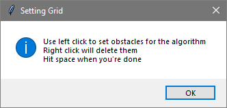

# Search Algorithm Visualizer
> A way to visualize different search algorithms to help analyze them

This small python script and necessary modules contain code that create an interactive board where the user can play with different search algorithms. This can help with understanding run time of these algorithms as the board expands. This can also help demonstrate weak spots of other algorithms. 

<p align="center">
  
</p>

## Requirements
pygame
```sh
pip install pygame
```
tkinter - Included in Python standard library\
heapq - Included in Python standard library

## Usage Example
### First Menu
The first menu is where you design your board, choose which algorithm you would like to see, and if you want all of the steps displayed or not.

<p align="center">
  
</p>

The number of rows and columns must be positive integers, you can put in almost anything you'd like here but the board becomes hard to properly interact with accurately if you set these above 100. This menu also consists of a drop down menu where you can see all the algorithms to choose from (at the time of writing this currently Breadth-First Search, Depth-First Search, A*, and Bidirectional A*). Also, if you check the "Display Steps" box, this will include a visual of the algorithm running. This example, I chose 20 rows, 20 columns, with the A* algorithm, and to display all the steps.

### Second Menu and the Board
After hitting done, you will see a board drawn of a bunch of black boxes and another menu pop up.

<p align="center">
  
</p>

This menu is where you can choose your starting point and end point. The x-coordinates of the points must be within [0, number_of_rows-1] and similarly, the y-coordinates of the points must be within [0, number_of_columns-1]. The x and y coordinates need to be seperated by a comma as well. In this example, I chose my starting point to be 0,0 and the end point to be 19,19.

<p align="center">
  
</p>

After hitting done, you will get a pop up explaining how to interact with the board. After hitting "Okay" on this popup and clicking on the board. You can then click on the squares to change them from black to white. If the square is white, that means the search algorithm will not be able to move to that square. You hold down your left mouse button and drag your mouse to change multiple blocks at a time. If you click on a block by accident, simply right click it to set it back to black. Hit the space bar when you're done.

<p align="center">
  
</p>

### Running

After hitting the space bar, you can watch the algorithm explore. The yellow points are on the frontier and the blue points are in the explored set, more on those will be discussed later down. After it finds the path, it will change it to a teal color to see it easier.

## Key Terms
### Frontier
The frontier of a search algorithm are nodes that is has seen and know how to get to, but it hasn't checked it's neighbors yet. These are the nodes that will get explored next. Even though a node is on the frontier, we are not sure if that is it's shortest path.

### Explored Set
After a node has been fully explored, meaning we have checked all of it's neighbors and added them to the frontier, then that node goes into the explored set. Once a node has gone into the explored set, we know we have found the shortest path to that node. 

### Heuristic
A heuristic is a function that will estimate the remaining path length. For optimality, it is important that this function is admissable. Common examples of heuristics are euclidean distance and manhattan distance.

### Admissable
A function is admissable if it never overestimates. The importance of this will be discussed in the A* section. 

### Complete
A function is complete if it is gauranteed to find an answer if it exists.

### Optimal
A solution is optimal if it returns the best answer. In terms of path finding, this is usually the shortest or cheapest path. 

### Branching Factor
In regards to trees, the branching factor is how many nodes are generated for each node in a layer. If the branching factor is 5 and you are at a depth of 2, that layer will have 25 nodes (1 -> 5 -> 25). Branching factor is usually expressed as b, and depth as d.

## Algorithms
### Breadth First Search

Breadth first search is a very simple search algorithm where it will examine all the nodes at a single level before going any deeper. On this board, it will look at all the squares that are 1 block away from the starting position before it moves. The only ordering of nodes is the way the neighbors are generated. The time and space complexity of BFS is O(b<sup>d</sup>) for both. This is because all nodes are stored in memory, and you have to look at all neighbors of every node. BFS is guaranteed to be optimal and complete, if b is finite and there are identical step weights between nodes. 

### Depth First Search

Depth first search is similar to breadth first search but instead of looking at all the nodes on one row before moving to the next level, it will explore as deep into a node it can go first before moving onto the next node. 

### A*
### Bidirectional A*
