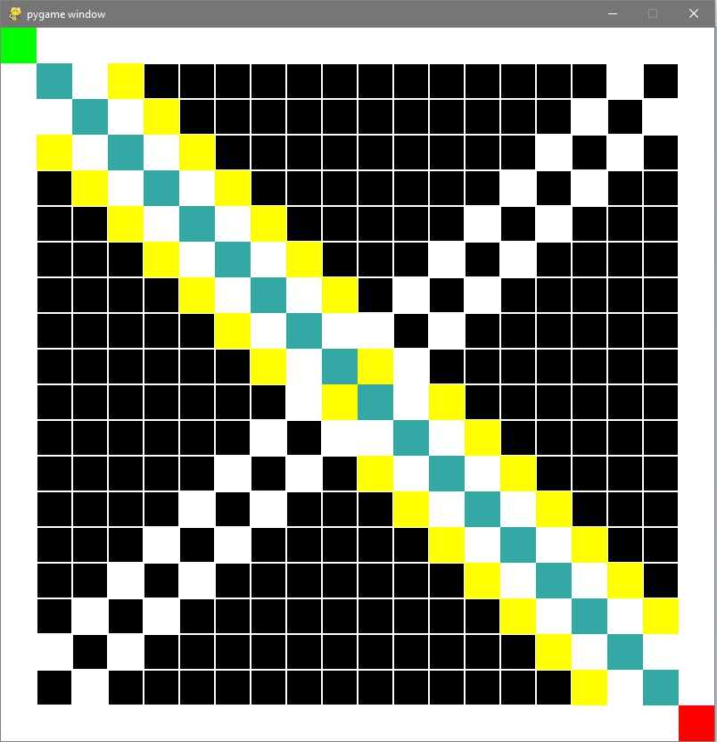

# Search Algorithm Visualizer
> A way to visualize different search algorithms to help analyze them

This small python script and necessary modules contain code that create an interactive board where the user can play with different search algorithms. This can help with understanding run time of these algorithms as the board expands. This can also help demonstrate weak spots of other algorithms. 

