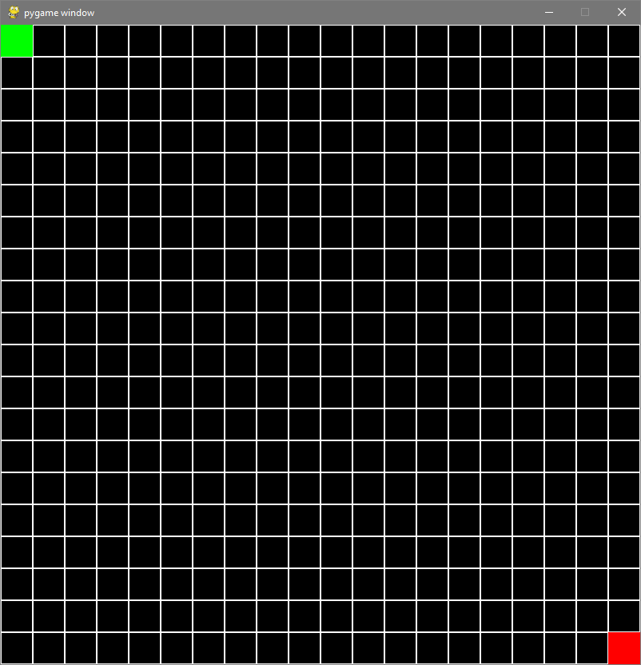

# Search Algorithm Visualizer
> A way to visualize different search algorithms to help analyze them

This small python script and necessary modules contain code that create an interactive board where the user can play with different search algorithms. This can help with understanding run time of these algorithms as the board expands. This can also help demonstrate weak spots of other algorithms. 

<p align="center">
  
</p>

## Requirements
pygame
```sh
pip install pygame
```
tkinter - Included in Python standard library\
heapq - Included in Python standard library

## Usage Example
### First Menu
The first menu is where you design your board, choose which algorithm you would like to see, and if you want all of the steps displayed or not.

<p align="center">
  
</p>

The number of rows and columns must be positive integers, you can put in almost anything you'd like here but the board becomes hard to properly interact with accurately if you set these above 100. This menu also consists of a drop down menu where you can see all the algorithms to choose from (at the time of writing this currently Breadth-First Search, Depth-First Search, A*, and Bidirectional A*). Also, if you check the "Display Steps" box, this will include a visual of the algorithm running. This example, I chose 20 rows, 20 columns, with the A* algorithm, and to display all the steps.

### Second Menu and the Board
After hitting done, you will see a board drawn of a bunch of black boxes and another menu pop up.

<p align="center">
  
</p>

This menu is where you can choose your starting point and end point. The x-coordinates of the points must be within [0, number_of_rows-1] and similarly, the y-coordinates of the points must be within [0, number_of_columns-1]. The x and y coordinates need to be seperated by a comma as well. In this example, I chose my starting point to be 0,0 and the end point to be 19,19.

<p align="center">
  
</p>
